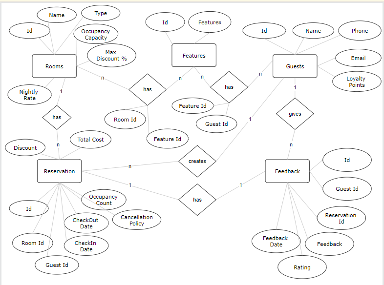

# Hotel Booking System

This ERD was developed using pair programming methodology. One, the driver, writes code while the other, the observer or navigator, reviews each line of code as it is typed in. The two programmers **SWITCH ROLES** frequently.

- Colaborated with
[@JaivigneshJv](https://github.com/JaivigneshJv)
[[repo](https://github.com/JaivigneshJv/GenSpark)]

## Entity Relationship Diagram (ERD)

The ERD for this system includes the following entities:

## Entities

The entities in this system and their attributes are as follows:

- **Rooms**: Id, Name, Type, Occupancy Capacity, Nightly rate, DiscountPercentage
- **Guests**: Id, Name, Phone No, Email, Loyalty points, List<Reservations>
- **Reservation**: Id, Room Id, Guest Id, CheckIn Date, Checkout Date, Occupancy Count, Cancellation Policy, Total cost, Discount
- **Feedback**: Id, Guest Id, Reservation Id, Feedback, Rating, Feedback Date
- **Features**: Id, Feature
- **Guest Features**: Guest Id, Features Id
- **Room Features**: Room Id, Feature Id

## Functional Requirements Coverage:
- **Room Inventory Management**: Covered with the Rooms entity, including details like room type, features, capacity, nightly rate, and discount percentage.
- **Reservation Processing:** Handled by the Reservation entity, which tracks booking details such as check-in and check-out dates, occupancy count, cancellation policy, total cost, and any applicable discounts.
- **Guest Management:** Managed through the Guests entity, capturing guest contact details, preferences, loyalty points, and their reservation history.
## Optional Enhancements Coverage:
- **Loyalty Program Integration:** Supported by the Guests entity's loyalty points attribute, which can be used to implement loyalty programs offering discounts or complimentary services based on guest stays.
- **Feedback and Rating System:** Implemented via the Feedback entity, enabling guests to provide feedback on their stay and rate the hotel's services, facilitating informed decisions for future guests.

## Functional Requirements [Application]

### Room Inventory Management
Maintain a comprehensive inventory of available rooms, including details such as room type (e.g., single, double, suite), features (e.g., air conditioning, Wi-Fi, ocean view), occupancy capacity, and nightly rate.

### Reservation Processing
Enable guests to search for available rooms based on their desired check-in and check-out dates, room type, and occupancy needs. Allow guests to book rooms, providing personal details, specific preference. Generate reservation confirmations that include reservation details, total cost, and cancellation policies.

### Guest Management
Maintain records of guests including contact details, reservation history, and preferences. Implement functionality for guests to view their reservation details, modify bookings, or cancel reservations.

#### Non-Functional Requirements:

1. **User Interface:**
   - Design an intuitive console interface with clear navigation and prompts to ensure ease of use for both guests and hotel staff.

2. **Efficiency:**
   - Ensure that the system processes bookings and updates quickly and accurately, especially during peak booking periods.

3. **Reliability:**
   - The system should be highly reliable, maintaining continuous operation and preserving data integrity.

4. **Security:**
   - Implement strong security measures to protect guest data and financial transactions from unauthorized access.

5. **Scalability:**
   - Design the system to easily accommodate growth in hotel size, number of bookings, and expansion into new locations without significant changes to the core architecture.

#### Optional Enhancements:

1. **Loyalty Program Integration:**
   - Integrate a loyalty program to reward frequent guests with discounts, upgrades, or complimentary services.

2. **Feedback and Rating System:**
   - Include a system for guests t